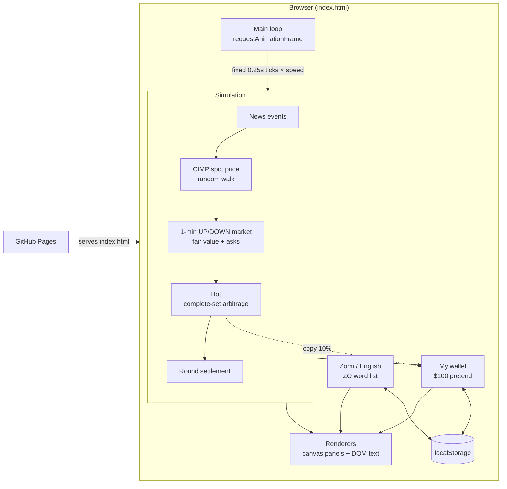
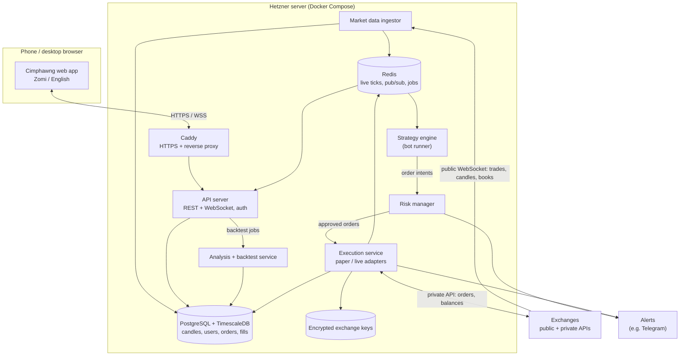
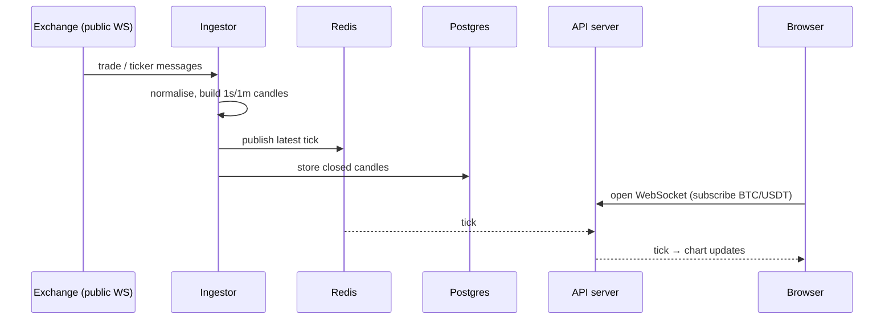
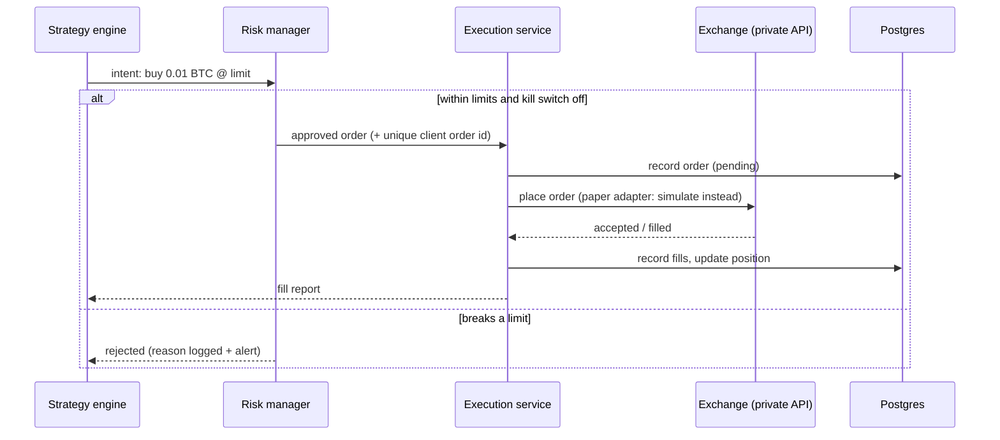

# Cimphawng Architecture

This document describes two things:

1. **Today:** how the Cimphawng Terminal works right now. It is a single static web page, and everything is simulated.
2. **Target:** the proposed design for growing it into a full-stack crypto platform with real market data,
   analysis, paper trading and, last of all, automated trading with real money on a Hetzner server.

The target design is a **proposal**. Section 8 lists the decisions that are still open.

---

## 1. Guiding principles

- **Real money comes last.** Every feature moves up the same ladder: **simulated → paper (real prices, pretend money) → live, small → live**.
  Nothing skips a rung.
- **One code path, swappable edges.** A strategy runs the same code in a backtest, in paper trading and live.
  Only the *data source* and the *execution adapter* change, so what we test is what we run.
- **Only one component touches exchange keys.** The execution service is the only part that can place real orders,
  and every order passes a separate risk check first.
- **Keys never leave the server.** Exchange API keys are never stored in the repo, the browser or the frontend.
- **Zomi first.** Everything a user sees goes through the translation list, with Zomi as the default and English as the alternative.

---

## 2. Today: the static terminal

The whole app is one file, `index.html` (HTML, CSS and JavaScript, with no build step), hosted on GitHub Pages.
There is no server and no real market. Every number comes from a simulation that runs in the browser.



### 2.1 Modules inside `index.html`

The script is one self-contained function, split into these sections (search for `// ----------`):

| Section | Responsibility |
|---|---|
| constants | `ROUND` = 60s market, `DT` = 0.25s tick, `SIGMA` volatility, `EDGE` = 1.5¢ minimum set edge, 1-second candles |
| language | `ZO` English→Zomi word list, `tr()` lookup, swapping static labels, remembered language choice |
| simulation state | `S`: spot price, candles, order book, bot stats, current round, news |
| price news | `fireNews()`: random headlines that move the price over 6–12s. Part of each move sticks through a slowly relaxing "anchor" price |
| `tick()` | Advances the world by one step: news → spot price → candles → book → UP/DOWN fair value and asks → bot → settlement |
| bot | `botStep()` decides trades. `buy()` records fills and pairs UP and DOWN legs first-in, first-out (FIFO) into complete sets. `settle()` pays out when the round ends |
| my wallet | `W`: cash, CIMP holdings, optional copy-trading of the bot, saved to `localStorage` |
| derived metrics | Volatility, momentum, book imbalance, tilt and round mark-to-market, recomputed for each frame |
| canvas helpers and panels | One draw function per panel (equity, matrix, arcs, spot, funnel, VWAP, neural shell, wallet chart) |
| main loop | Fixed-step simulation, redraws throttled (see below), a warm-up of about 40 rounds at start |

### 2.2 Timing

| What | How often |
|---|---|
| Simulation tick | Every 0.25s of simulated time (×1, ×4 or ×16 speed) |
| Neural shell | Every animation frame |
| Other charts | Every 120ms |
| Text, order book, feed, wallet | Every 250ms |
| Wallet value history | Every 1s |

### 2.3 Stored data (browser only)

| Key | Contents |
|---|---|
| `cimphawng-wallet-v1` | Cash, CIMP amount and cost, bot copy on/off, bot P/L, last 20 actions. Open bot positions are refunded at cost when saved |
| `cimphawng-lang` | `zo` or `en` |

Both are wrapped in `try/catch`, so the page still works where storage is blocked.

### 2.4 Known limits of today's design

- One file of about 1,200 lines, which is fine for now but will get hard to change as features grow.
- Everything is per-browser: no accounts, no sync between devices, and the bot stops when the tab closes.
- No tests. It is checked by driving it in a headless browser.

---

## 3. Target: full-stack platform on Hetzner



### 3.1 Components

| Component | Job | Notes |
|---|---|---|
| **Web app** | The terminal UI: charts, analysis, wallets, bot controls | Keeps the current look. Split into modules with a small build step (e.g. Vite) once the server exists |
| **Caddy** | HTTPS certificates, reverse proxy, serving the static web app | Only ports 80 and 443 are open to the internet |
| **API server** | Logins, REST endpoints, WebSocket that streams live prices and bot status to the browser | Never talks to exchanges with private keys |
| **Market data ingestor** | Subscribes to exchange public WebSockets, normalises trades into candles, and stores and publishes them | Reconnects automatically, fills gaps from REST history |
| **Analysis + backtest** | Indicators (moving averages, RSI, MACD, volatility, support/resistance), backtests on stored history | Uses the same strategy code as the live engine |
| **Strategy engine** | Runs each enabled bot on live data and emits **order intents** ("buy 0.01 BTC, limit $X") | Cannot place orders itself |
| **Risk manager** | Checks every intent against limits and approves or rejects it | See section 5 |
| **Execution service** | Turns approved orders into exchange orders, tracks fills, reconciles balances | The **only** holder of exchange keys. Has a `paper` adapter (simulated fills on real prices) and a `live` adapter |
| **PostgreSQL + TimescaleDB** | Durable storage: candles (time series), users, strategies, orders, fills, positions, audit log | Backed up daily |
| **Redis** | Fast live data: latest ticks, pub/sub between services, job queue | Can be lost and rebuilt, so it is not the source of truth |

### 3.2 Proposed tech stack

| Layer | Choice | Why |
|---|---|---|
| Backend language | **Python 3.12** | Best ecosystem for analysis and trading: pandas, TA libraries, and **ccxt** (one library for 100+ exchanges) |
| API framework | FastAPI | Async, built-in WebSocket support, automatic API docs |
| Database | PostgreSQL 16 + TimescaleDB | Reliable, and handles candle time series well |
| Cache / messaging | Redis | Simple pub/sub and queues |
| Frontend | Current HTML/JS, then modules + Vite (TypeScript optional) | No rewrite needed. Grow it gradually |
| Runtime | Docker Compose on one Hetzner server | Simple to run and to move. Split services across servers only if needed |
| CI/CD | GitHub Actions: test, build images, deploy over SSH | A merge to `main` deploys |
| Monitoring | Structured logs, health checks, Uptime Kuma or Grafana, Telegram alerts | Know within a minute when a bot or feed stops |

---

## 4. Key flows

### 4.1 Live prices to your phone



### 4.2 A bot placing an order



Every order carries a unique **client order ID**, so a retry after a network error can't create a duplicate order.
The execution service also regularly **reconciles** its records against the exchange's actual balances and open orders.

---

## 5. Safety for automated trading (step 4)

| Guard | What it does |
|---|---|
| Trade-only API keys | Keys are created on the exchange **without withdrawal permission**, and **IP-restricted** to the Hetzner server's address |
| Encrypted at rest | Keys are stored encrypted, and the decryption key comes from the server environment, never from the repo |
| Per-order limit | Maximum size of a single order |
| Position limit | Maximum exposure per coin and in total |
| Daily loss limit | The bot stops for the day after losing a set amount |
| Kill switch | One button (and a Telegram command) cancels all open orders and halts every bot |
| Stale-data guard | No trading if prices are older than a few seconds or the feed is disconnected |
| Audit log | Every intent, approval, rejection, order and fill is recorded with a timestamp |
| Promotion rule | A strategy goes live only after **several weeks of paper trading** on the same code, and then with small limits |

---

## 6. Server setup on Hetzner

- **Server:** start with one Hetzner Cloud server (2–4 vCPU, 4–8 GB RAM) running Ubuntu LTS. That is plenty for data ingestion, a database and several bots.
- **Access:** SSH keys only (password login off), a non-root deploy user, `ufw` or the Hetzner firewall allowing only 22, 80 and 443,
  `fail2ban`, automatic security updates.
- **Deploy:** `docker compose` with one service per component. GitHub Actions builds the images and deploys over SSH on merge to `main`.
- **Backups:** nightly `pg_dump` to Hetzner Storage Box (or another off-server location) plus Hetzner snapshots. Restores are tested.
- **Domain:** a domain pointed at the server. Caddy obtains HTTPS certificates automatically.
- **Secrets:** a `.env` file on the server only, listed in `.gitignore`, never committed.

---

## 7. Roadmap mapped to components

| Step | Adds | Where it runs |
|---|---|---|
| **Now** | Simulated terminal, $100 wallet, news events, Zomi/English, CIMP | GitHub Pages (browser only) |
| **1. Real market data** | Live BTC, ETH and other coin prices and charts next to CIMP | Browser connects directly to a public exchange WebSocket. No server needed yet |
| **2. Analysis** | Indicators and backtesting | Starts in the browser, then moves to the analysis service once history is stored |
| **3. Full stack + paper trading** | Hetzner server, API, database, ingestor, logins, strategy engine, risk manager, execution service in **paper** mode. Bots keep running when your phone is off | Hetzner |
| **4. Automated trading** | Execution service **live** adapter, encrypted keys, all section 5 guards, alerts | Hetzner |

### 7.1 Proposed repository layout (from step 3)

```
cimphawng/
├── web/                 # frontend (today's index.html, split into modules)
├── server/
│   ├── api/             # FastAPI app: auth, REST, WebSocket
│   ├── ingest/          # market data ingestor
│   ├── analysis/        # indicators + backtester
│   ├── engine/          # strategy runner + strategies
│   ├── risk/            # risk manager
│   └── execution/       # paper + live adapters
├── infra/               # docker-compose.yml, Caddyfile, deploy scripts
├── docs/                # this file and other docs
└── .github/workflows/   # CI/CD
```

---

## 8. Open decisions

| Decision | Options | Why it matters |
|---|---|---|
| Which exchange(s) | e.g. Binance, Bybit, OKX, Coinbase, Kraken | Availability depends on your country. Affects fees, coins and API limits |
| Who uses it | Just you, or friends and the Zomi community too | Decides how much account, permission and privacy work step 3 needs |
| CIMP | Stays a pretend token, or becomes a real on-chain token | A real token is a separate project with its own legal and security questions |
| Backend language | Python (recommended) or Node.js | Python fits analysis and trading libraries best. Node.js would match the frontend language |
| Domain name | e.g. a `cimphawng` domain | Needed for HTTPS on Hetzner and a nicer phone link |
