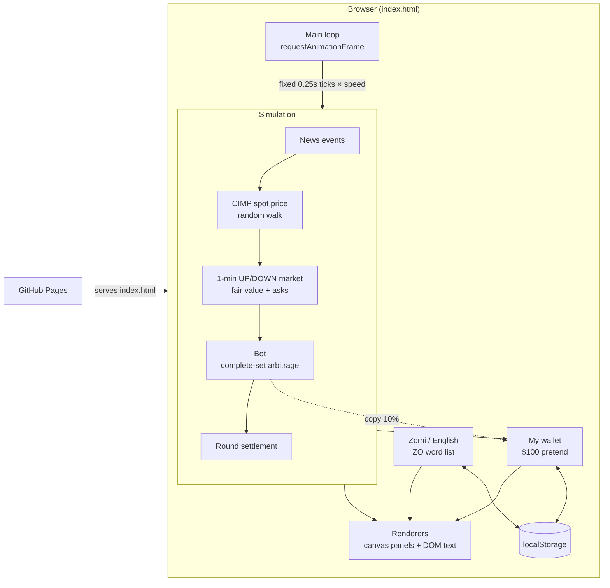
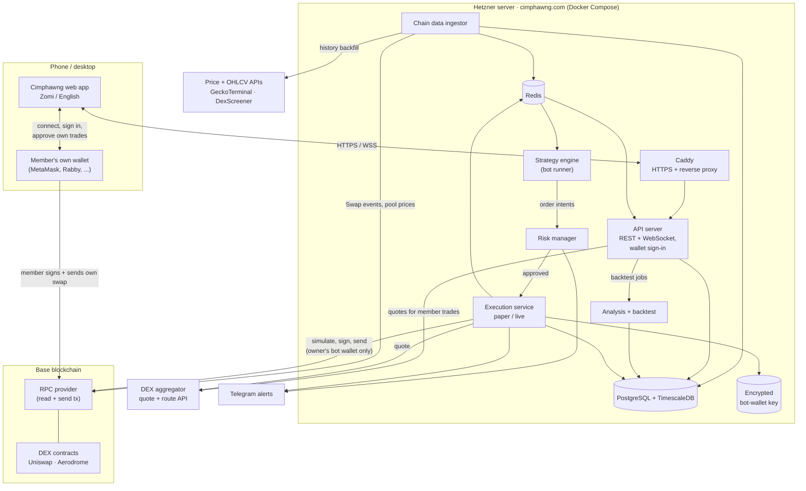
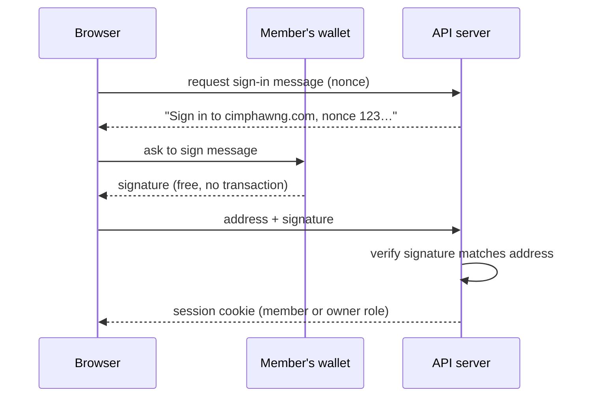
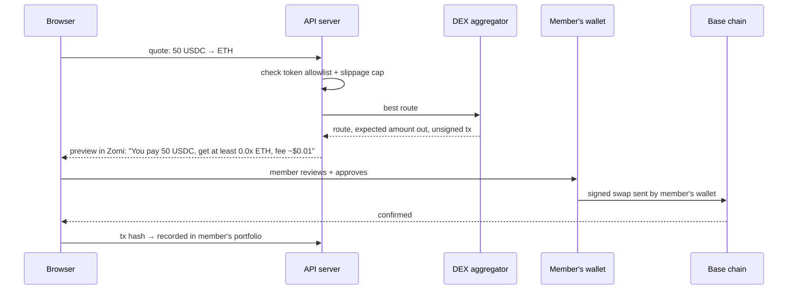
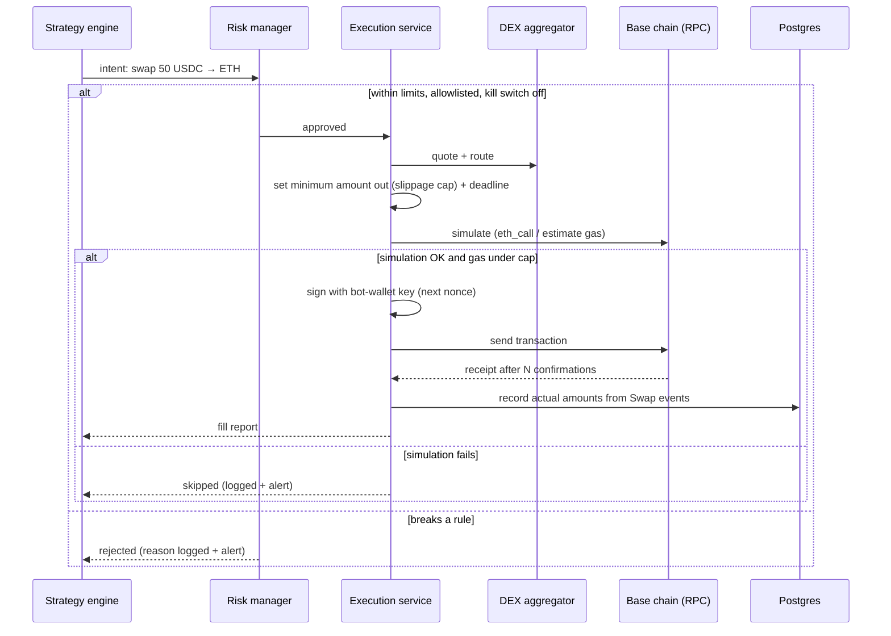

# Cimphawng Architecture

This document describes two things:

1. **Today:** how the Cimphawng Terminal works right now. It is a single static web page. The CIMP market is simulated, and the Base DEX panel reads real prices (read-only).
2. **Target:** the design for growing it into a full-stack crypto platform for **you and the Zomi community**. It
   covers real prices from **decentralized exchanges (DEXs)**, analysis, paper trading and, last of all, automated
   trading with real money. It runs on a Hetzner server at **cimphawng.com**.

The target design is a **plan**, not built yet. Section 9 records what has been decided and what is still open.

---

## 1. Guiding principles

- **Real money comes last.** Every feature moves up the same ladder: **simulated → paper (real prices, pretend money) → live, small → live**.
  Nothing skips a rung.
- **Non-custodial: members keep their own coins.** Cimphawng never holds, moves or signs for a community member's money.
  Members connect their own wallet (MetaMask, Rabby, Coinbase Wallet and others), and every real trade a member makes is approved and signed
  **in their own wallet**. This keeps members in control of their own funds, and keeps Cimphawng out of the legal and security
  burden of looking after other people's money.
- **Automated real-money trading is for the owner's wallet only.** The server-side bot trades only from the owner's dedicated,
  small "bot wallet". Community members get analysis, paper-trading bots and one-tap trades they sign themselves.
- **One code path, swappable edges.** A strategy runs the same code in a backtest, in paper trading and live.
  Only the *data source* and the *execution adapter* change, so what we test is what we run.
- **Only one component can sign.** The execution service is the only part that can use the bot wallet's private key,
  and every transaction passes a separate risk check and a simulation first.
- **Keys never leave the server.** The bot wallet's private key is never stored in the repo, the browser or the frontend.
- **Zomi first.** Everything a user sees goes through the translation list, with Zomi as the default and English as the alternative.

---

## 2. Today: the static terminal

The whole app is one file, `index.html` (HTML, CSS and JavaScript, with no build step), hosted on GitHub Pages.
There is no server. The CIMP market and bot are a simulation that runs in the browser. The **Base DEX** panel reads real ETH and cbBTC prices
from public APIs (read-only, no wallet).



### 2.1 Modules inside `index.html`

The script is one self-contained function, split into these sections (search for `// ----------`):

| Section | Responsibility |
|---|---|
| constants | `ROUND` = 60s market, `DT` = 0.25s tick, `SIGMA` volatility, `EDGE` = 1.5¢ minimum set edge, 1-second candles |
| language | `ZO` English→Zomi word list, `tr()` lookup, swapping static labels, remembered language choice |
| simulation state | `S`: spot price, candles, order book, bot stats, current round, news |
| price news | `fireNews()`: random headlines that move the price over 6–12s. Part of each move sticks through a slowly relaxing "anchor" price |
| `tick()` | Advances the world by one step: news → spot price → candles → book → UP/DOWN fair value and asks → bot → settlement |
| bot | `botStep()` decides trades. `buy()` records fills and pairs UP and DOWN legs first-in, first-out (FIFO) into complete sets. `settle()` pays out when the round ends |
| my wallet | `W`: cash, CIMP holdings, optional copy-trading of the bot, saved to `localStorage` |
| Base DEX live data | Finds the top USDC pool for ETH and cbBTC on Base, then polls GeckoTerminal for pool stats (30s), candles (60s) and trades (30s), falling back to DexScreener for prices. Pauses while hidden, backs off on errors (15s up to 5 min). About 5 requests a minute |
| derived metrics | Volatility, momentum, book imbalance, tilt and round mark-to-market, recomputed for each frame |
| canvas helpers and panels | One draw function per panel (equity, matrix, arcs, spot, funnel, VWAP, neural shell, wallet chart) |
| phone tabs | Below 760px wide, panels are grouped into five tabs (`data-tab` on each panel) with a floating tab bar. Charts on hidden tabs are skipped |
| main loop | Fixed-step simulation, redraws throttled (see below), a warm-up of about 40 rounds at start |

### 2.2 Timing

| What | How often |
|---|---|
| Simulation tick | Every 0.25s of simulated time (×1, ×4 or ×16 speed) |
| Neural shell | Every animation frame |
| Other charts | Every 120ms |
| Text, order book, feed, wallet | Every 250ms |
| Wallet value history | Every 1s |

### 2.3 Stored data (browser only)

| Key | Contents |
|---|---|
| `cimphawng-wallet-v1` | Cash, CIMP amount and cost, bot copy on/off, bot P/L, last 20 actions. Open bot positions are refunded at cost when saved |
| `cimphawng-lang` | `zo` or `en` |
| `cimphawng-base-pools-v1` | The discovered Base pool addresses, cached for 24 hours |
| `cimphawng-tab` | The last phone tab opened (`home`, `markets`, `cimp`, `bot`, `ai`) |

Both are wrapped in `try/catch`, so the page still works where storage is blocked.

### 2.4 Known limits of today's design

- One file of about 1,200 lines, which is fine for now but will get hard to change as features grow.
- Everything is per-browser: no accounts, no sync between devices, and the bot stops when the tab closes.
- Real prices depend on free public APIs and their rate limits. Every visitor's browser calls them directly.
- No tests. It is checked by driving it in a headless browser.

---

## 3. Target: full-stack DEX platform on Hetzner

### 3.1 Which chain

A DEX lives on a blockchain, so the first real choice is the chain. The recommendation is to **start with Base**,
an Ethereum layer-2:

- **Low fees:** a swap usually costs cents, not dollars, which matters for small community trades and for bots.
- **Deep DEX liquidity:** Uniswap and Aerodrome, with native USDC, ETH and cbBTC.
- **Portable code:** Base is EVM-compatible, so the same Python code (`web3.py`) and the same wallets (MetaMask, Rabby, Coinbase Wallet)
  also work on Arbitrum, BNB Chain, Polygon and Ethereum. Adding another EVM chain later is mostly configuration.
- **Easy to see:** block explorers and free price APIs cover it well.

Solana (Jupiter, Raydium) is the main alternative. It would need a different code path and different wallets,
so it's better added later, not first. This is still an open decision (section 9).

### 3.2 System overview



### 3.3 Components

| Component | Job | Notes |
|---|---|---|
| **Web app** | Terminal UI: charts, analysis, pretend and real portfolios, bot controls | Connects to the member's wallet in the browser. Split into modules with a small build step (Vite) once the server exists |
| **Member's wallet** | The member's own keys. Signs the sign-in message and the member's own trades | Cimphawng never sees seed phrases or private keys |
| **Caddy** | HTTPS certificates, reverse proxy, serving the web app | Only ports 80 and 443 are open to the internet |
| **API server** | Wallet sign-in, REST and WebSocket, member portfolios, quotes for member trades | Builds unsigned trades for members to review. **Never signs for them** |
| **Chain data ingestor** | Watches chosen DEX pools: swap events and pool prices over the RPC WebSocket, candles built from swaps, history backfilled from price APIs, gas prices | Reconnects automatically, fills gaps, handles chain reorgs |
| **Analysis + backtest** | Indicators (moving averages, RSI, MACD, volatility, support/resistance), liquidity and volume stats, backtests that include swap fees, slippage and gas | Uses the same strategy code as the live engine |
| **Strategy engine** | Runs bots on live data and emits **order intents** ("swap 50 USDC → ETH") | Paper bots for everyone. A live bot only for the owner's bot wallet. Cannot sign anything |
| **Risk manager** | Checks every intent against limits and allowlists | See section 5 |
| **Execution service** | Quote → build transaction → simulate → sign with the bot wallet → send → confirm → record | The **only** holder of the bot-wallet key. `paper` adapter fills at real quoted prices, including slippage and gas, without sending anything |
| **PostgreSQL + TimescaleDB** | Users (wallet addresses), strategies, candles, paper and real trades, positions, audit log | Backed up daily |
| **Redis** | Latest prices, pub/sub between services, job queue | Can be rebuilt, so it is not the source of truth |

### 3.4 Tech stack

| Layer | Choice | Why |
|---|---|---|
| Backend language | **Python 3.12** (decided) | Best fit for analysis and trading work |
| API framework | FastAPI + Uvicorn | Async, built-in WebSocket support, automatic API docs |
| Blockchain | `web3.py` | Mature EVM library: read pools, decode events, build, simulate and sign transactions |
| Sign-in | Sign-In with Ethereum (SIWE, EIP-4361) | Members log in by signing a free message in their wallet. No passwords, no gas, no money moves |
| Data + analysis | pandas, numpy, a technical-analysis library | Indicators and backtests |
| Database | PostgreSQL 16 + TimescaleDB, SQLAlchemy + Alembic | Reliable, handles candle time series, managed schema changes |
| Cache / messaging | Redis | Simple pub/sub and queues |
| Frontend wallet | `viem` + standard wallet discovery (EIP-6963), WalletConnect for mobile wallets | Works with browser-extension and phone wallets |
| Testing | pytest, plus **Anvil** (Foundry) to fork Base locally | Test real swaps against a copy of the chain, with no real money |
| Runtime | Docker Compose on one Hetzner server | Simple to run and to move |
| CI/CD | GitHub Actions: test, build images, deploy over SSH | A merge to `main` deploys |
| Monitoring | Structured logs, health checks, Uptime Kuma or Grafana, Telegram alerts | Know within a minute when a bot, feed or RPC stops |

---

## 4. Key flows

### 4.1 Member signs in with their wallet



### 4.2 Member makes a real swap (signed in their own wallet)



### 4.3 Owner's bot places a trade (automated)



The execution service manages **nonces** (transaction numbers) for the bot wallet itself, so transactions never collide,
and it replaces stuck transactions with higher-fee versions. It also regularly **reconciles** its records against
the wallet's real on-chain balances.

---

## 5. Safety

### 5.1 For the owner's automated bot (step 5)

| Guard | What it does |
|---|---|
| Separate bot wallet | A new wallet used **only** by the bot, holding only what it's allowed to trade. Savings stay in a hardware or cold wallet that is never on the server. Top-ups are done by hand |
| Encrypted key | The bot-wallet key is stored encrypted. The decryption key comes from the server environment, never the repo |
| Token + pool allowlist | The bot only trades reviewed tokens and pools (e.g. ETH, USDC, cbBTC). This blocks scam, honeypot and fee-on-transfer tokens |
| Exact approvals | Token spending approvals only for known router contracts, and only for the amount needed. No unlimited approvals |
| Slippage cap + deadline | Every swap sets a minimum amount out (e.g. at most 0.5–1% worse than quoted) and expires after a short deadline |
| Simulate first | Every transaction is simulated before sending, and skipped if it would fail |
| Gas caps | A maximum fee per transaction and a daily gas budget |
| Trade limits | Per-trade size, position size per token, total exposure |
| Daily loss limit | The bot stops for the day after losing a set amount |
| Kill switch | One button (and a Telegram command) stops every bot immediately |
| Stale-data guard | No trading if prices are old or the RPC or feed is down |
| Confirmations | A trade is final only after several block confirmations, so reorgs are handled |
| Front-running protection | Base has no public mempool, which makes sandwich attacks much harder. Tight slippage caps still apply. On Ethereum mainnet, send through a private RPC |
| Audit log | Every intent, check, simulation, transaction and fill is recorded |
| Promotion rule | A strategy goes live only after **several weeks of paper trading** on the same code, and then with small limits |

### 5.2 For the Zomi community

- **Never ask for a seed phrase.** The site says clearly, in Zomi and English, that Cimphawng will **never** ask for a seed phrase or private key.
  Scammers often pretend to be community tools, so this message is shown where members connect their wallet.
- **Clear previews.** Before a member signs anything, the site explains in plain Zomi what they pay, the minimum they receive and the fee.
- **Same allowlists and slippage caps** apply to member swaps built by the API.
- **No managed money.** Members can copy a strategy in paper mode, or make a one-tap trade they sign themselves. Cimphawng does not run
  bots with members' funds. Doing that would mean holding or controlling other people's money, which brings legal duties.
  Revisit only with proper legal advice.
- **No promises.** The site never promises profits, and analysis is labelled as education, not financial advice.
- **Privacy.** A member is identified only by wallet address plus an optional display name. No email or ID is needed.

---

## 6. Server, domain and hosting

- **Domain:** use **cimphawng.com** as the main address. It's the most familiar ending and has no residency rules. `.us` domains
  require a US connection (a US citizen, resident or organisation). If both are registered, redirect `cimphawng.us` to `cimphawng.com`.
- **Addresses:** one origin keeps things simple: `cimphawng.com` for the web app, `cimphawng.com/api` for REST and `cimphawng.com/ws` for live data.
  With one origin, sign-in cookies work with no cross-site setup.
- **Before the server (steps 1–2):** GitHub Pages can serve `cimphawng.com` with a custom domain. At step 3, point the DNS
  (A/AAAA records) at the Hetzner server instead.
- **Server:** one Hetzner Cloud server (2–4 vCPU, 4–8 GB RAM) running Ubuntu LTS. That is plenty for the ingestor, database, API and bots.
  The blockchain itself is reached through an RPC provider, so no full Base node is needed.
- **Access:** SSH keys only (password login off), a non-root deploy user, Hetzner firewall allowing only 22, 80 and 443, `fail2ban`,
  automatic security updates.
- **Deploy:** `docker compose` with one service per component. GitHub Actions builds the images and deploys on merge to `main`.
- **Backups:** nightly `pg_dump` to a Hetzner Storage Box plus server snapshots. Restores are tested.
- **Secrets:** a `.env` file on the server only (RPC keys, bot-key passphrase, Telegram token), listed in `.gitignore`, never committed.

---

## 7. Roadmap mapped to components

| Step | Adds | Where it runs | Real money? |
|---|---|---|---|
| **Now** | Simulated terminal, $100 wallet, news events, Zomi/English, CIMP | GitHub Pages | No |
| **1. Real DEX prices** ✅ | Live ETH and cbBTC prices, candles and trades from their top USDC pools on Base, next to CIMP. GeckoTerminal API, DexScreener fallback | Browser only. Can move to `cimphawng.com` via GitHub Pages | No |
| **2. Analysis** ✅ | MA20/MA50, RSI 14, volatility, crossover signals, and a backtest (MA cross or RSI 30/70, 0.3% fee, no lookahead) on up to 300 candles. More Base coins still to choose | Browser | No |
| **3. Full stack + community** 🚧 | Hetzner server, wallet sign-in, member profiles, ingestor, database, paper-trading bots for every member. **Part 1 done:** API with wallet sign-in and paper swaps at live prices, PostgreSQL, Caddy, Docker Compose, deploy guide, CI tests. **Part 2 done:** web app Connect-wallet button and paper-trading panel. **Next:** paper bots, WalletConnect for phone wallets without an in-app browser, Alembic migrations, a separate ingestor and Redis once more services need live data | Hetzner · cimphawng.com | No |
| **4. Member one-tap swaps** | Quotes and Zomi previews. Members sign and send swaps from **their own wallet**. Portfolio tracking from the chain | Hetzner + member wallets | Yes, the member's own, signed by them |
| **5. Owner's automated bot** | Execution service live adapter, bot wallet, every section 5.1 guard, alerts | Hetzner | Yes, the owner's bot wallet only |

> **Step 3 part 1 simplifications.** The price feed runs inside the API process, as one shared GeckoTerminal poller for
> all members. Tables are created on start-up. Redis isn't used yet. These change when the strategy engine and bots arrive
> and several services need the same live data.

### 7.1 Repository layout (from step 3)

```
cimphawng/
├── web/                 # frontend (today's index.html, split into modules)
├── server/
│   ├── api/             # FastAPI: wallet sign-in, REST, WebSocket, member quotes
│   ├── ingest/          # chain data ingestor (pools, swaps, candles, gas)
│   ├── analysis/        # indicators + backtester
│   ├── engine/          # strategy runner + strategies
│   ├── risk/            # risk manager, allowlists, limits
│   └── execution/       # paper + live adapters, nonce manager, signer
├── infra/               # docker-compose.yml, Caddyfile, deploy scripts
├── docs/                # this file and other docs
└── .github/workflows/   # CI/CD
```

---

## 8. What "DEX" changes compared with a centralized exchange

| Topic | Centralized exchange | DEX (this design) |
|---|---|---|
| Account | Username + API keys | A wallet address, with no account needed |
| Placing a trade | API call | A signed blockchain transaction that costs gas |
| Custody | The exchange holds coins | The wallet owner holds coins |
| Prices | Order book | Liquidity pools. Price depends on trade size (slippage) |
| Main risks | Exchange hacks and freezes | Key theft, scam tokens, bad approvals, slippage, failed transactions |
| Market data | Exchange WebSocket | RPC events and public price and indexer APIs |

---

## 9. Decisions

### 9.1 Decided

| Decision | Choice |
|---|---|
| Trading venue | **DEX first**, EVM chains |
| Users | **The owner and the Zomi community**, non-custodial |
| Backend language | **Python** |
| Domain | **cimphawng.com**, with cimphawng.us as an optional redirect |
| Server | **Hetzner** |

### 9.2 Still open

| Decision | Options | Recommendation |
|---|---|---|
| First chain | Base, Arbitrum, BNB Chain, Solana | **Base**: low fees, deep liquidity, works with common wallets |
| DEXs and quotes | Direct Uniswap/Aerodrome contracts, or an aggregator (0x, 1inch, Odos) | Aggregator for best prices on member swaps. Direct pool reads for data |
| RPC provider | Alchemy, QuickNode, Infura or public RPC | Start on a free tier, and add a second provider as backup |
| Starting token list | e.g. ETH, USDC, cbBTC | Start small and review before adding tokens |
| CIMP | Stays a pretend token, or becomes a real on-chain token | Keep it pretend for now. A real token is a separate project with its own legal and security questions |
| Domain purchase | Register cimphawng.com (and .us if eligible) | Register soon so the name is secured |
